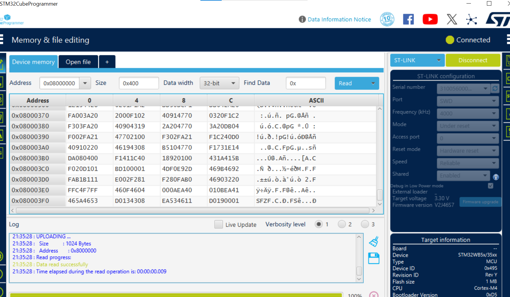
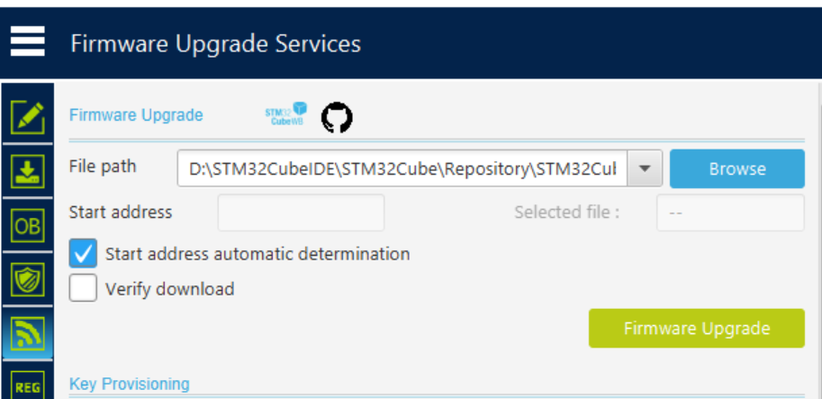
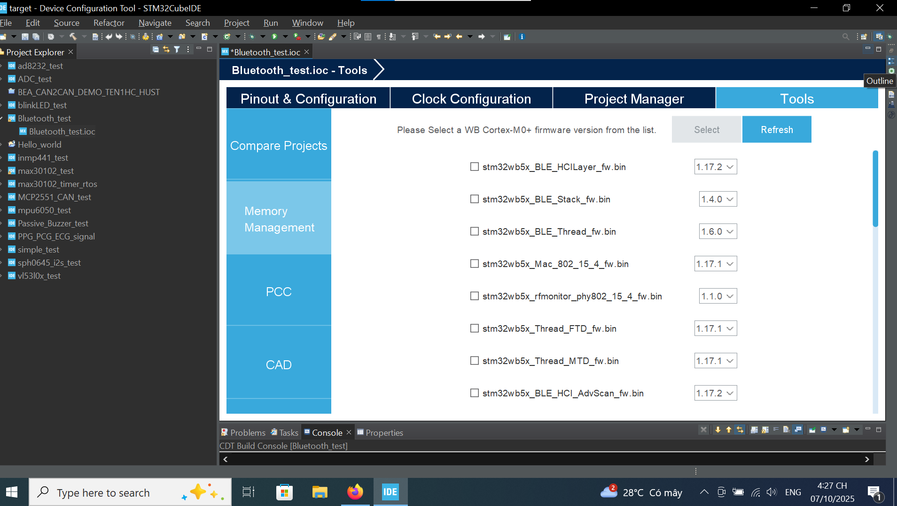
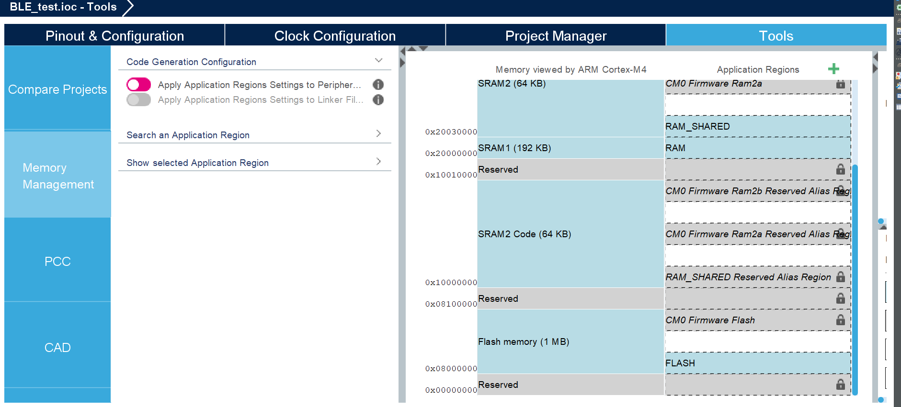

# GIỚI THIỆU VỀ MCU STM32WB5x #

*** 
Luong Huu Phuc - 2025/10/08
***
STM32WB5x là dòng vi điều khiển (MCU) của STMicroelectronics, tích hợp 2 lõi xử lý ARM Cortex trong cùng một chip:
	- Cortex-M4: Dành cho ứng dụng người dùng (Application Core).
	- Cortex-M0+: Dành cho xử lý wireless stack (Bluetooth Low Energy, Thread, Zigbee...). Phần này không thể can thiệp trực tiếp từ user

- Nhờ kiến trúc dual-core, STM32WB5x cho phép tách biệt rõ ràng giữa phần mềm ứng dụng và phần mềm truyền thông không dây (RF).
- Các tính năng nổi bật:
	- Hỗ trợ Bluetooth 5.2 Low Energy (BLE), Thread, Zigbee.
	- Tích hợp bộ RF 2.4GHz bên trong chip (không cần module ngoài).
	- Có Flash và SRAM chia sẻ (Shared Memory) giữa hai lõi.
	- Tích hợp bộ quản lý năng lượng (RCC, PWR) để điều khiển hoạt động RF.
	- Hỗ trợ nhiều giao tiếp ngoại vi: SPI, I2C, UART, USB, ADC, DAC, SAI, v.v.
	- Bộ nhớ Flash: 1MB, RAM: 256KB (SRAM1 + SRAM2)
	
# PHẦN MỀM & PACKAGE CẦN THIẾT # 
Để phát triển và nạp chương trình cho STM32WB55, cần chuẩn bị các công cụ sau:

## 1. STM32CubeIDE 
IDE chính thức từ ST, dùng để:
	- Cấu hình chân và ngoại vi (Pinout & Configuration).
	- Sinh mã khởi tạo tự động (HAL/CMSIS).
	- Viết, biên dịch, và nạp chương trình cho lõi Cortex-M4.

Tải tại: https://www.st.com/en/development-tools/stm32cubeide.html

## 2. STM32CubeProgrammer 
Dùng để: 
	- Kết nối và nạp firmware qua ST-LINK hoặc UART/USB.
	- Ghi và đọc bộ nhớ Flash.
	- Quản lý Firmware Upgrade Services (FUS) và wireless stack trên lõi M0+.

Tải tại: https://www.st.com/en/development-tools/stm32cubeprog.html

## 3. STM32CubeWB Firmware Package 
- Package này sẽ được tự động tải về khi bạn tạo project với STM32WB5x 
- Package này bao gồm: 
	- Driver HAL, CMSIS cho STM32WB series
	- Middleware Bluetooth (BLE, ZigBee, Thread)...
	- Các firmware BLE stack, ZigBee, Thread cho lõi Cortex-M0+
	
## 4. ST-LINK USB Driver & ST-LINK Server 
- **ST-Link USB driver** sẽ giúp Windows nhận diện thiết bị nạp ST-LINK 
	- Kiểm tra trong **Device Manager** -> "Universal Serial Bus devices" 
	- Tên thiết bị là **STM32 STLink** và tên driver sẽ là  **STMicroelectronics STLink dongle.**
	
- **ST-Link Server** là một phần mềm trung gian (middewarr service) do STMicroelectronics phát triển
	- Nó hoạt động như một cổng giao tiếp chun giữa: 
		- Thiết bị ST-Link (phần cứng debug/programmer)
		- Và các công cụ phần mềm như STM32CubeIDE, Cube Programmer,...
```pgsql
+-------------------------+
|   STM32CubeIDE / CLI    |
+-----------+-------------+
            |
            v
+-------------------------+
|     ST-LINK Server      |  <-- Quản lý giao tiếp, debug, nạp
+-----------+-------------+
            |
            v
+-------------------------+
|        ST-LINK HW       |  <-- ST-LINK V2/V3 dongle
+-----------+-------------+
            |
            v
+-------------------------+
|     STM32WB MCU (M4/M0+)|
+-------------------------+

```

# CÁCH NẠP FIRMWARE BLE CHO LÕI CORTEX-M0+ BẰNG STM32CUBE PROGRAMMER #

- Cấu trúc phần mềm cho BLE của STM32WB55:
```sql
+---------------------------------------------------+
|  Application (Cortex-M4)                          |
|  - User code                                      |
|  - BLE App (App_BLE.c / App_BLE.h)                |
|  - Middleware: HCI, GATT, GAP APIs                |
+---------------------------------------------------+
|  Wireless Coprocessor (Cortex-M0+)                |
|  - BLE Stack (Link Layer, Controller, etc.)       |
|  - Pre-compiled binary from ST                    |
+---------------------------------------------------+
```

- Lõi **M0+** của STM32WB55 không trực tiếp lập trình từ CubeIDE mà ban đầu sẽ được nạp firmware Wireless Coprocessor thủ công thông qua Cube Programmer
- Sau khi nạp firmware cho **M0+** thì điều khiển RF vẫn thực hiện từ core **M4** thông qua cơ chế giao tiếp IPCC (Inter Processor Communication Controller) và HSEM (Hardware Semamphore) để quản lý truy cập chung thông qua **Shared RAM**
- Cơ chế giao tiếp giữa **M4** và **M0+** là IPCC + **shared RAM** + Transport Layer (TL/HCI-like)

## Nạp BLE stack Firmware cho core **M0+**
1. Vào **STM32Cube Programmer**, cắm mạch ST-LINK Debugger vào máy tính. Đảm bảo trong Devive Manager nhận diện được USB.
- Trong cấu hình, set up như sau:

```sql
Port: SWD
Mode: Under Reset
Access Port: 0 #core M4
Reset Mode: Hardware Reset 
Speed: Reliable 
Shared: Enabled
```


- Đặc biệt cần phải enabled **Shared** để có thể ST-Link có thể truy cập tài nguyên bộ nhớ chung giữa hai lõi **M4** và **M0+**, tránh xung đột bus khi M0+ (BLE firmware) đang chạy 
- Sau khi kết nối thành công, giao diện hiển thị ra như sau:



- Tiếp theo, từ thanh công cụ bên trái, mở **Firmware Upgrade Service (FUS)**
- Trong phần file path, browse và tìm kiếm bên trong folder **Repository** (chứa các packages của STM32Cube) và tìm đúng đến folder chứa firmware của STM32WB có tên `STM32Cube_FW_WB_V1.23.0`
- Vào `Projects`, tìm tới `STM32WB_Copro_Wireless_Binaries` và chọn `STM32WB5x`
- Tìm tới file mà bạn mong muốn nạp, ví dụ BLE thì dùng file `stm32wb5x_BLE_Stack_full_fw.bin`
- Sau khi chọn xong, nhấn `Firmware Upgrade` để nạp firmware đã chọn vào vùng flash đặc biệt của lõi **M0+**
- Sau khi nạp xong sẽ hiển thị `Firmware Upgrade Successfully`
- Từ nay về sau, mỗi lần nạp code trên core **M4**, nó sẽ giao tiếp với M0+ qua IPCC để điều khiển BLE stack



# QUY TRÌNH TẠO PROJECT & NẠP CHƯƠNG TRÌNH TRÊN STM32CUBE IDE #
## 1. Mở STM32CubeIDE -> New STM32 project ##
- Chọn chip hoặc board: `STM32WB5x`
- Đặt tên project, nhấn Finish
- Khi đó toàn bộ các folder chứa driver, firmware, API của board tương ứng sẽ được load vào project

## 2. Cấu hình cơ bản trong `.ioc`
- Active `IPCC`, `HSEM`
- Bật RCC (Reset and Clock Control), điều cần thiết để có thể sử dụng xung nhịp cao cho các ứng dụng như BLE hoạt động ổn định
	- Mở HSE (High Speed External) và LSE (Low Speed External) 
- Trong connectivity, bật **RF**
- Cấu hình UART/SPI/I2C tùy nhu cầu
- Activate `RTC (Real time clock)` trong **Timers**. Nghe không liên quan nhưng đây là dependency rất quan trọng vì:
	- RTC cung cấp nguồn thời gian cho BLE scheduler hoạt động vì BLE là giao thức yêu cầu độ chính xác cao về thời gian. Mọi quá trình như advertising, scanning, connection interval hay sleep/wakeup đều cần đồng bộ ở mức ms 
	- Đóng vai trò làm timebase chính xác và ổn định, đảm bảo BLE hoạt động đúng chu kỳ
	- Ngoài ra nó còn giúp đồng bộ thời gian giữa 2 lõi thông qua IPCC
- Trong phần Tools, đi đến Memory Management.


	
- Đây là các gói fimrmware của Cortex-M0+ được ST cung cấp. Chọn vào package mà bạn đã load vào firmware vừa này. Sau đó, giao diện sẽ hiển thị phân vùng bộ nhớ chia sẻ (**shared memory**) giữa M4 và M0+
 
 
 	
- Cột bên trái chính là hình ảnh bản đồ bộ nhớ của lõi Cortex-M4 bao gồm phân vùng RAM và Flash (địa chỉ ảo mà M4 truy cập được)
 	- RAM chính M4, dung lượng 192KB
	- RAM phụ, 64KB, có thể được chia sẻ hoặc dùng riêng
	- Một số vùng khác bị Reversed - dành riêng cho M0+ 
- Cột bên phải - "Application Region".Đây chính là phân vùng logic do bạn (hoặc CubeMX) tạo ra để gán cho từng lõi hoặc chức năng.
 	- Ví dụ trong hình:
 		- `CM0 Firmware Ram2a, Ram2b`: là vùng RAM mà firmware BLE (chạy trên M0+) sử dụng.
 		- `RAM_SHARED`: là vùng RAM được chia sẻ giữa hai lõi để trao đổi dữ liệu (qua IPCC hoặc HSEM). Có thể đổi size, access permission
 		- `RAM`: phần còn lại của RAM dùng riêng cho ứng dụng M4.
 		- Biểu tượng khóa thể hiện đó là Reversed/Locked, bạn không thể thay đổi (vì dành cho stack BLE của ST)
		- Riêng có bộ nhớ Flash thì chỉ có mỗi M4 có thể ghi được còn M0+ chỉ được đọc thôi
		- Ngoài ra bạn còn có thể định nghĩa các vùng khác nếu muốn cả 2 lõi đọc được
# CHÚ Ý
- Nếu project của bạn sử dụng cả FreeRTOS thì cần phải chuyển qua CMSIS_V2 lý do là vì:
	- Các thành phần trong STM32_WPAN được viết dựa trên CMSIS_V2 API, chứ không dùng trực tiếp CMSIS_V1 như FreeRTOS API native 
	- Cụ thể, trong code ST, bạn sẽ thấy các hàm như sau:
```c
osThreadNew();
osMessageQueueNew();
osSemaphoreRelease();
osDelay();
```
	-> Đây là API của **CMSIS-RTOS V2**, không phải FreeRTOS gốc
- Thực chất **CMSIS_V2** chỉ là lớp adapter của FreeRTOS
	- FreeRTOS trong STM32Cube không mất đi mà chỉ là ST đã thêm 1 lớp Adapter vào để chuẩn hóa cách gọi hàm
	- Cấu trúc thực tế:
```
Ứng dụng (App) 
   ↓
CMSIS-RTOS v2 API
   ↓
FreeRTOS kernel (real RTOS engine)
```
- BLE stack và ST middleware sẽ gọi các hàm CMSIS-V2 
- CMSIS layer sẽ map chúng sang các hàm tương ứng của FreeRTOS
```c
osThreadNew()      → xTaskCreate()
osSemaphoreRelease() → xSemaphoreGive()
osDelay()           → vTaskDelay()
```
- **Thế nên**, nếu bạn muốn dùng FreeRTOS và BLE middleware cùng một lúc thì cần phải sử dụng CMSIS_V2 để đồng bộ các API với nhau, tránh xung đột cách gọi hàm 
